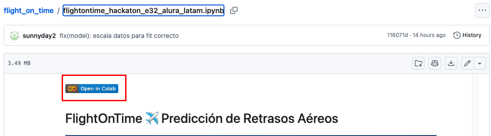
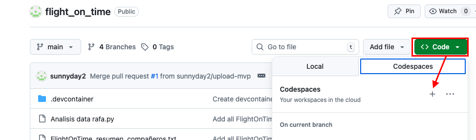

# ✈️ FlightOnTime – MVP Predicción de Retrasos de Vuelos

# Descripción del proyecto

FlightOnTime es un producto mínimo viable (MVP) que utiliza Ciencia de Datos y Machine Learning para predecir si un vuelo será Puntual o Retrasado, antes de su despegue.

La solución está orientada al sector de Aviación Civil, Logística y Transporte Aéreo, y expone un servicio de predicción en tiempo real mediante una API REST, permitiendo a aerolíneas, aeropuertos y sistemas externos anticiparse a retrasos operativos., desde datos históricos hasta un modelo listo para ser integrado en una API.

---

## 🎯 Problema de negocio (no técnico)

Los retrasos en vuelos generan impactos significativos:

❌ Insatisfacción de los pasajeros

💰 Incremento de costos operativos

🔁 Pérdida de conexiones y reprogramaciones

🏗️ Uso ineficiente de la infraestructura aeroportuaria

Actualmente, muchas decisiones se toman de forma reactiva, cuando el retraso ya ocurrió.

---

## 🧠 Solución propuesta

FlightOnTime permite anticipar el riesgo de retraso utilizando información disponible antes del vuelo, como:

- Aerolínea
- Ciudad de origen
- Hora del vuelo
- Distancia
- Condiciones climáticas

Beneficios clave:

📲 Pasajeros informados con antelación

✈️ Aerolíneas con mejor planificación operativa

🏢 Aeropuertos con uso más eficiente de recursos

Incluso un modelo simple genera valor inmediato, al identificar vuelos con mayor probabilidad de retraso.

---

## Alcance del MVP

Tipo de problema: Clasificación binaria

Salida del modelo:

- Puntual o Retrasado
- Probabilidad

Enfoque: Modelo ligero, explicable y reproducible

Orientado a: Hackathon / Always Free / Entorno académico

---

## Dataset Utilizado

```
dataset_vuelos_clima_final.csv
```
Variables utilizadas (nombres originales, sin modificaciones):

- marketing_airline_network
- origincityname
- hour
- distance
- temp_mean
- precipitation
- wind_speed

Variable objetivo:

- delayed = 0 → Vuelo puntual
- delayed = 1 → Vuelo retrasado

El dataset combina información operacional de vuelos con condiciones climáticas, permitiendo capturar patrones relevantes de retraso.
Incluye **features meteorológicas** integradas desde una API externa de clima.

---

## Proceso de Data Science

### Exploración y limpieza
- Revisión de valores nulos
- Selección de variables relevantes
- Separación de variables numéricas y categóricas

### Feature Engineering
- Extracción de hora desde la fecha
- Codificación de variables categóricas (One-Hot Encoding)
- Escalado de variables numéricas

### Modelos entrenados
Se entrenaron y compararon dos modelos:

### Logistic Regression (modelo final)
- Modelo simple y explicable
- Buen equilibrio entre métricas
- Fácil de integrar en un backend

### Random Forest (modelo comparativo)
- Usado como benchmark
- Se realizó una versión ajustada para reducir overfitting

---

## Resultados principales

### Logistic Regression

- Accuracy ≈ **0.68 – 0.81** (según umbral)
- Buen control del trade-off entre precision y recall
- Modelo elegido para el MVP

### Random Forest

- Accuracy ≈ **0.81**
- Mejor ROC AUC
- Menor interpretabilidad

> Aunque Random Forest tiene métricas competitivas, se priorizó **explicabilidad y simplicidad** para el MVP.

---

## Ajustes realizados

- Se analizó el impacto de **modificar el umbral de decisión** para aumentar la precision
- Se ajustaron hiperparámetros del Random Forest para análisis
- **Solo el modelo base se exporta**, los ajustes quedan como análisis

---

## Modelo exportado

El modelo final entrenado se guarda como:

```
model/MVP_entrenamiento.pkl
```

Incluye:

- preprocesamiento
- modelo entrenado
- listo para ser cargado por un backend

---

## Ejemplo de entrada (JSON)

```json
{
  "aerolinea": "AZ",
  "origen": "GIG",
  "destino": "GRU",
  "fecha_partida": "2025-11-10T14:30:00",
  "distancia_km": 350
}
```

### Ejemplo de salida esperada

```json
{
  "prevision": "Puntual",
  "probabilidad": 0.24
}
```

---

## Tecnologías utilizadas

- Python
- Pandas
- scikit-learn
- Jupyter Notebook (para ejecutar archivos .ipynb localmente) o un entorno virtual
- joblib
- FastAPI

---

```bash
#### Para revisar las versiones instaladas
import pandas as pd
import numpy as np
import matplotlib
import seaborn as sns
import plotly

print("pandas:", pd.__version__)
print("numpy:", np.__version__)
print("matplotlib:", matplotlib.__version__)
print("seaborn:", sns.__version__)
print("plotly:", plotly.__version__)
```
  
## ¿Cómo puedes ejecutar un notebook?

- Ejecutarlo localmente en Visual Studio Code.
- Cargar el archivo `.ipynb` a tu Google Drive y ejecutarlo en [Google Colab](https://colab.research.google.com).
- Abrir el enlace a Google Colab:  
  
- Ejecutarlo en GitHub Codespaces. En tu repositorio, haz clic en el botón verde **Code** → pestaña **Codespaces** → selecciona **Create codespace on main** (o en la rama que quieras).  
  

  
## ⚙️ Instalación y dependencias en el entorno virtual

```bash

# 🧰 ¿Qué necesitas para ejecutar .ipynb localmente?
# ✅ 1. Tener Python instalado
# - Puedes descargarlo desde python.org.
# - Asegúrate de marcar “Add Python to PATH” durante la instalación.

### ✅ 2. Instalar Jupyter Notebook o JupyterLab
# - Lo más cómodo es hacerlo dentro de un entorno virtual:

# Crear entorno virtual (solo la primera vez)
python -m venv venv

# Activar el entorno
# En Windows:
venv\Scripts\activate

# En macOS/Linux:
source venv/bin/activate

# Instalar Jupyter y librerías necesarias
pip install notebook jupyterlab pandas numpy matplotlib seaborn plotly

# ✅ 3. Ejecutar Jupyter Notebook
jupyter notebook
```

## Estado del proyecto

✔ MVP funcional  
✔ Modelo entrenado y evaluado  
✔ Listo para integración vía API REST  

---

## Trabajo futuro

- Integración completa con API REST (Spring Boot)
- Ajuste dinámico del umbral según negocio
- Dashboard visual de predicciones
- Persistencia de predicciones

---

## Equipo

Proyecto desarrollado como parte de un **hackathon ONE** de Data Science y Back-End.

👥 Equipo Ciencia de Datos

* Ezequiel Samuel Prilusky
* Javier Menéndez
* Ganna Kharkovska
* Rafael Osuna
* Alexander Tovar Morcillo

Colaboracion del equipo de Back-End

Como MVP para hackathon académico.

🏁 Conclusión

FlightOnTime demuestra cómo una solución de Ciencia de Datos bien integrada puede generar valor inmediato, incluso con un modelo simple, cuando está alineada a un problema real de negocio y expuesta mediante una arquitectura clara y escalable.
